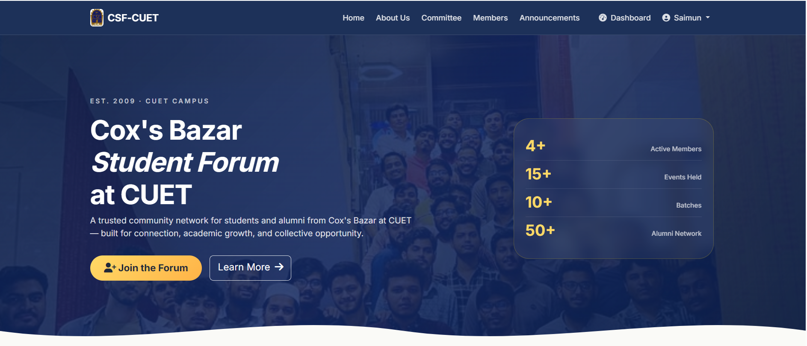

# CSF-CUET – Cox's Bazar Student Forum at CUET



A community platform designed for students, alumni, and members of the Cox's Bazar district studying at Chittagong University of Engineering & Technology (CUET). The platform serves as a digital hub for communication, announcements, events, committee management, and community engagement.

---

## 🌐 Live Website

**Production URL**

https://cox-s-bazar-student-forum-cuet.onrender.com

---

## 📌 Project Overview

CSF-CUET aims to strengthen communication and collaboration among students and alumni from Cox's Bazar who are part of the CUET community.

The platform provides:

* Community announcements
* Event management
* Member directory
* Committee management
* Public posts and engagement
* Administrative moderation tools
* Responsive user experience for desktop and mobile devices

---

## ✨ Features

### User Management

* Custom User Model
* User Registration
* Login & Logout
* Profile Management
* Profile Photo Upload
* Admin Approval System

### Community Features

* Create and View Posts
* Like and Comment System
* Public Community Feed
* Member Profiles

### Event Management

* Publish Upcoming Events
* Event Details Page
* Event Announcements

### Announcement System

* Organization Announcements
* Homepage Announcement Highlights
* Administrative Control

### Committee Management

* Committee Member Profiles
* Designation Management
* Public Committee Display

### Department Information

* Department-wise Member Organization
* Department Management Panel

### Administrative Dashboard

* Django Admin Integration
* Content Moderation
* User Approval Workflow
* Announcement and Event Management

---

## 🛠 Technology Stack

| Category        | Technology                   |
| --------------- | ---------------------------- |
| Backend         | Django 5                     |
| Language        | Python                       |
| Frontend        | HTML5, CSS3, Bootstrap 5     |
| Icons           | Font Awesome                 |
| Database        | SQLite (Development)         |
| Authentication  | Django Authentication System |
| Deployment      | Render                       |
| Version Control | Git & GitHub                 |

---

## 📂 Project Structure

```text
CSF/
│
├── core/
│   ├── migrations/
│   ├── static/
│   ├── templates/
│   ├── models.py
│   ├── views.py
│   ├── urls.py
│   └── admin.py
│
├── csf_cuet/
│   ├── settings.py
│   ├── urls.py
│   ├── asgi.py
│   └── wsgi.py
│
├── media/
├── image/
├── staticfiles/
├── manage.py
├── requirements.txt
└── README.md
```

---

## 🚀 Local Installation

### Clone Repository

```bash
git clone https://github.com/ashraf1600/Cox-s-Bazar-Student-Forum-CUET.git
cd Cox-s-Bazar-Student-Forum-CUET
```

### Create Virtual Environment

```bash
python -m venv venv
```

### Activate Environment

Windows:

```bash
venv\Scripts\activate
```

Linux/macOS:

```bash
source venv/bin/activate
```

### Install Dependencies

```bash
pip install -r requirements.txt
```

### Apply Migrations

```bash
python manage.py migrate
```

### Create Superuser

```bash
python manage.py createsuperuser
```

### Run Development Server

```bash
python manage.py runserver
```

---

## 👨‍💻 Developer

**Ashraful Islam**

Computer Science & Engineering (CSE)

Chittagong University of Engineering & Technology (CUET)

---

## 📄 License

This project was developed for the Cox's Bazar Student Forum at CUET and is intended for educational and organizational use.
